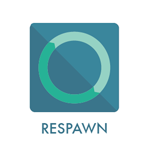

<a name="logo"/>

<a href="" target="_blank">
</img>
</a>

Version History
================

__v1.0.0__

* Initial release

Introduction
============

Infrastructure templates and utilities for building AWS CloudFormation stacks. Respawn uses [cfn-pyplates] to generate CloudFormation templates. A pyplate is a class-based python representation of a JSON CloudFormation template and resources, with the goal of generating CloudFormation templates based on input python templates (pyplates!) that reflect the CloudFormation template hierarchy.

Respawn is a Python package that provides interfaces to Amazon Web Services - Cloudformation. It allows for easier and more user friendly and concise yaml keywords to create resources/parameters/userdata in CloudFormation stacks. This is used in Dow Jones pipeline and with success and has been modified to be as generic and serve all. Currently the library supports Python 2.7.

Authors
========

Respawn has been written by the following [authors](https://github.com/dowjones/respawn/graphs/contributors).
The logo for respawn has been designed by [Gregor Louden](http://www.gregorlouden.com).

Documentation
=============

Documentation is written in sphinx and hosted on [readthedocs](http://respawn.readthedocs.org/en/latest/).

Services
========

At the moment, respawn supports:

-   AutoScaling
    -   AutoScalingGroup
    -   LifecycleHook
    -   ScalingPolicy
    -   ScheduledAction
-   CloudWatch
    -   Alarm
-   Elastic Compute Cloud (EC2)
    -   Instance
    -   NetworkInterface
    -   NetworkInterfaceAttachment
    -   SecurityGroup
    -   Volume
-   Elastic Load Balancing (ELB)
    -   LoadBalancer
-   Relational Database Service (RDS)
    -   DBInstance
-   Simple Notification Service (SNS)
    -   Topic

The goal of respawn is to support the full breadth and depth of Amazon Web Services - resources. respawn is developed mainly using Python 2.7.x on Mac OSX and Ubuntu. It is known to work on Linux Distributions, Mac OS X and Windows.

Installation
============

To install respawn, simply:

Windows/Unix/Mac OS X
---------------------

-   Open command prompt and execute pip command :

<!-- -->

    pip install respawn

Usage - Template Generation
===========================

to use respawn, in your command prompt/terminal :

    $ respawn pathToYAML.yaml

to create & validate the JSON against AWS using [boto] and pipe output to a file:

    $ respawn --validate pathToYAML.yaml > pathToJSON.json

to pipe the output to a file :

    $ respawn pathToYAML.yaml > pathToJSON.json

  [respawn]: Logo/JPG/respawn-logo-dj-colors.jpg
  [image]: http://djin-jenkins01.dowjones.net:7777/buildStatus/icon?job=respawn
  [cfn-pyplates]: https://github.com/seandst/cfn-pyplates/tree/master/cfn_pyplates
  [boto]: https://github.com/boto/boto
  
Developing and Contributing
============================
  
We'd love to get contributions from you! Take a look at the [CONTRIBUTING.rst](CONTRIBUTING.rst) to see how to get
your changes merged in.
  
License
=========

[ISC](LICENSE.md)
